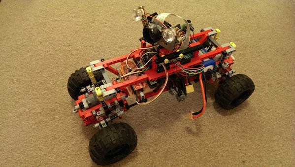

# Sir Lancelot



Sir Lancelot is a lego rover controlled by a Raspberry Pi. This repository holds the configuration for this rover, for the software that drives it see the [Pi Functions](http://github.com/xianic/PiFn) repository.

Use ```pifn``` (part of Pi Functions) to connect to Sir Lancelot, then the commands below to drive it.

## Driving Commands

Square brackets indicate optional arguments to commands.

Command | Action
:--------------- | :----------
f [&lt;speed&gt;] | Go forwards. At default speed (see zoom) or given speed.
b [&lt;speed&gt;] | Go backwards at default speed (see zoom) or given speed
zoom &lt;speed&gt; | Set the default speed for f and b commands.
zoom | Show the default speed.
r [&lt;speed&gt;], l [&lt;speed&gt;] | Steer right or left. Speed defaults to 7 which is full lock.
s | Go in a straight line.
h | Halt. Stops driving forward or back and straightens the wheels.
dl, dr | Steer diagonally left or right.
nod, shake | Wiggles the camera
ch | Camera Home. Points the camera straight ahead
cl &lt;vpos&gt; &lt;hpos&gt;| Camera Look.
lights on, lights off | Turns the headlights on or off
laser on, laser off | Turns the laser rangefinder on or off

The ```l```, ```r```, ```s```, ```dl``` and ```dr``` do not make Sir Lancelot move on their own, they are like only turning the stering wheel. The ```f``` and ```b``` commands are neede to make it move forwards and backwards, and ```h``` to make it come to a complete halt with the wheels straight.
